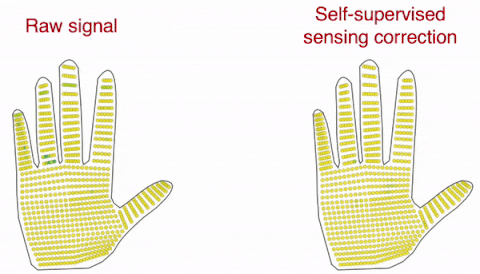
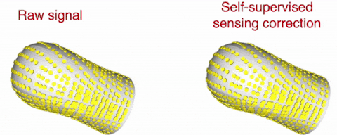

# Learning human-environment interactions using conformal tactile textiles

Yiyue Luo, Yunzhu Li, Pratyusha Sharma, Wan Shou, Kui Wu, Michael Foshey, Beichen Li,
Tomás Palacios, Antonio Torralba, Wojciech Matusik

**Nature Electronics 2021**
[[website]](http://senstextile.csail.mit.edu/)

## Introduction

This is a PyTorch-based implementation for self-supervised sensing correction, classification and human pose prediction in the paper "Learning human-environment interactions using conformal tactile textiles".

## Contents

- [Self-Supervised Sensing Correction](#self-supervised-sensing-correction)
- [Human Pose Estimation](#human-pose-estimation)
- [Classification](#classification)

## Self-Supervised Sensing Correction

#### Data and environment preparation
1. You will need to download the data from the link: [[DropBox]](https://www.dropbox.com/s/pf8cwj76w70kr6r/data_sensing_correction.zip?dl=0) (222.4 MB)
2. Uncompress the data and place them according to the following structure
```
sensing_correction/
|--data_sensing_correction/
|    |--glove_calibration/
|    |--kuka_calibration/
|    |--sock_calibration/
|    |--vest_calibration/
|    |--visualization/
|--glove_withscale/
...
```
3. Setup the environmental variable
```
cd sensing_correction
export PYTHONPATH=${PYTHONPATH}:${PWD}
```

#### Calibrate the glove using the scale

1. Generate demo visualizations using pretrained models
```
cd sensing_correction/glove_withscale
bash scripts/eval.sh
```
Visualizations showing the side-by-side comparison between the **raw signal (left)** and the **calibrated results (right)** are stored in `sensing_correction/glove_withscale/dump_glove_calibration/vis*`, and the following is a sample clip.



2. Training the calibration model for the glove using corresponding readings from the scale
```
cd sensing_correction/glove_withscale
bash scripts/calib.sh
```

#### Calibrate the sock using the scale

1. Generate demo visualizations using pretrained models
```
cd sensing_correction/sock_withscale
bash scripts/eval.sh
```
Visualizations showing the side-by-side comparison between the **raw signal (left)** and the **calibrated results (right)** are stored in `sensing_correction/sock_withscale/dump_sock_calibration/vis*`, and the following is a sample clip.


2. Training the calibration model for the sock using corresponding readings from the scale
```
cd sensing_correction/sock_withscale
bash scripts/calib.sh
```

#### Calibrate the vest using a calibrated glove

1. Generate demo visualizations using pretrained models
```
cd sensing_correction/vest_withglove
bash scripts/eval.sh
```
Visualizations showing the side-by-side comparison between the **raw signal (left)** and the **calibrated results (right)** are stored in `sensing_correction/vest_withglove/dump_vest_calibration/vis*`, and the following is a sample clip.


2. Training the calibration model for the vest using a pretrained calibrated glove
```
cd sensing_correction/vest_withglove
bash scripts/calib.sh
```

#### Calibrate the kuka sleeve using a calibrated glove

1. Generate demo visualizations using pretrained models. Note that you will have to install `Open3D 0.9.0` to visualize the kuka model in 3D.
```
cd sensing_correction/kuka_withglove
bash scripts/eval.sh
```
Visualizations showing the side-by-side comparison between the **raw signal (left)** and the **calibrated results (right)** are stored in `sensing_correction/kuka_withglove/dump_kuka_calibration/vis*`, and the following is a sample clip.



2. Training the calibration model for the kuka sleeve using a pretrained calibrated glove
```
cd sensing_correction/kuka_withglove
bash scripts/calib.sh
```


## Human Pose Estimation
We train a single model to predict all the joint angles of a human's body across the different action types and do not add any additional constraints for the predictions to look smooth over time.

```
Pose Prediction
|--smpl
|    |--verts.py
|    |--serialization.py
|    |--render_smpl.py
|    |--posemapper.py
|    |--lbs.py
|    |--models
|--train.py
|--models.py
|--dataloader.py
|--data_preprocessing.py
|--test_visualize.py
|--utils
|    |--rotation_matrix.py
|    |--transformations.py
...
```

Download the trained model, results and training data from the link: [[Dropbox]](https://www.dropbox.com/sh/gl5ukk6im1uj64r/AABTrd9qFqrLKOIwy8uU2vvSa?dl=0)

#### Generate demos using pretrained weights
```
python test_visualize.py
```
#### Training
```
python train.py --exp name_of_expt  
```

#### Testing
```
python train.py --exp test --test  
```
Examples of some visualizations below:


## Classification

#### Data preparation
1. You will need to download the data from the link: [[DropBox]](https://www.dropbox.com/s/vp5q6v85w14844v/data_classification.zip?dl=0) (451.2 MB)
2. Uncompress the data and place them according to the following structure
```
classification/
|--data_classification/
|    |--glove_objclaassification_26obj/
|    |--sock_classification/
|    |--vest_classification/
|    |--vest_letter/
|--letter_classification/
...
```

#### Letter classification using the vest
```
cd classification/letter_classification
bash scripts/train.sh
```
Results in the form of confusion matrix are stored in `classification/letter_classification/dump*`.

#### Action classification using the sock
```
cd classification/sock_classification
bash scripts/train.sh
```
Results in the form of confusion matrix are stored in `classification/sock_classification/dump*`.

#### Action classification using the vest
```
cd classification/vest_classification
bash scripts/train.sh
```
Results in the form of confusion matrix are stored in `classification/vest_classification/dump*`.

#### Object classification using the glove
```
cd classification/object_classification
bash scripts/train_26obj.sh
```
Results in the form of confusion matrix are stored in `classification/object_classification/dump*`.
